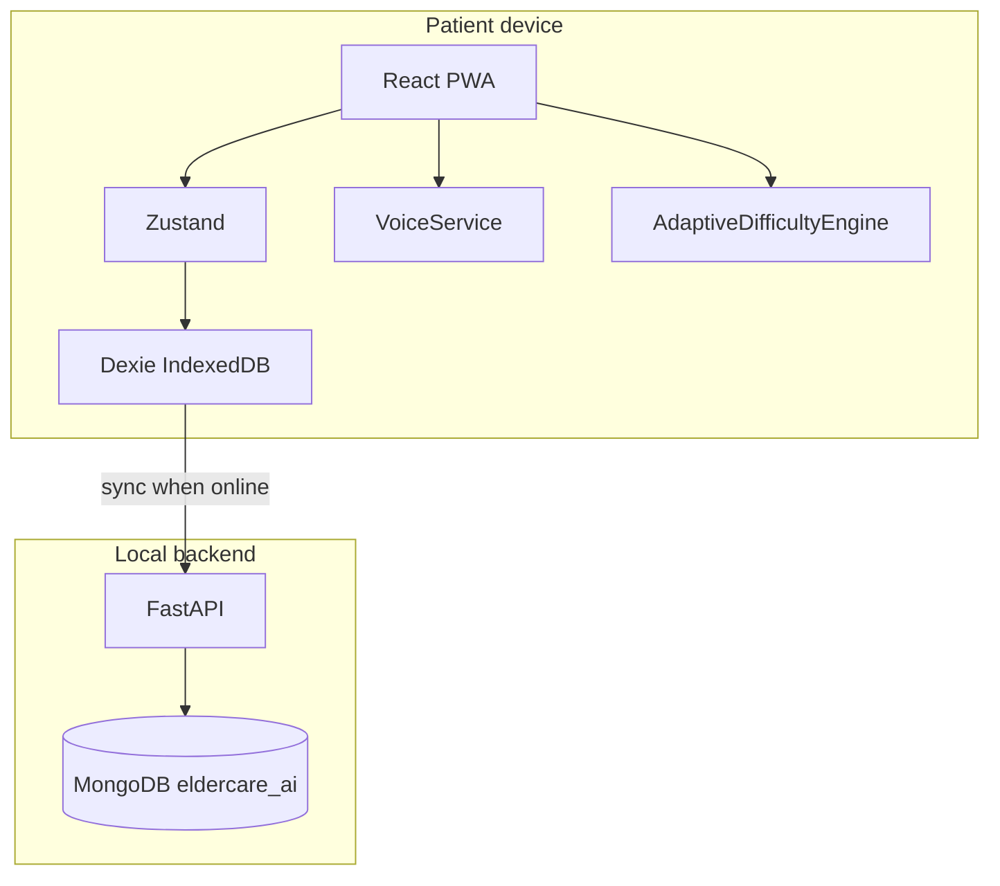

# Architecture

AI-Based Cognitive Gaming and Memory Assistance Platform (Problem 26003 — MDoNER).

This document is the technical source of truth for later phases. It describes intended design. **Phase 1 does not implement runtime code.**

## Non-diagnostic boundary

The system provides cognitive engagement, memory assistance, reminders, activity tracking, and caregiver support. It does **not** diagnose, treat, cure, or predict dementia. Analytics use labels such as **Cognitive Performance Score** or **Activity Performance Score** (0–100). Alerts never imply clinical worsening.

## High-level system

```text
React PWA (elderly + caregiver)
    → Zustand (session / UI state)
    → Dexie.js → IndexedDB (source of truth on the device)
    → Sync queue (when FastAPI is reachable)
FastAPI (local)
    → MongoDB `eldercare_ai` (localhost only)
```

The browser **never** connects to MongoDB. Only FastAPI uses `MONGODB_URI`.



## Application modes and roles

Two UI modes in one React app, with role-based routing:

| Mode | Typical roles | UX |
|------|----------------|-----|
| Elderly | `PATIENT` | Very large type, few choices, offline-first |
| Caregiver | `CAREGIVER`, `HEALTHCARE_WORKER`, `ADMIN` | Dashboards, trends, alerts, routine config |

Roles (JWT claims, Phase 11):

- `PATIENT`
- `CAREGIVER`
- `HEALTHCARE_WORKER`
- `ADMIN`

A patient session must work **without** the backend (local/demo identity stored in IndexedDB). Caregiver features that need a shared view of multiple devices require sync + auth when the backend is available.

## Module boundaries

| Area | Location | Responsibility |
|------|----------|----------------|
| UI | `frontend/src/components`, `pages`, `layouts` | Elderly design system vs caregiver chrome |
| Games | `frontend/src/games` | Five games, shared `GameResult` shape |
| Offline DB | `frontend/src/db` | Dexie schema, sync queue |
| State | `frontend/src/store` | Zustand; persist via Dexie, not Mongo |
| Voice | `frontend/src/services` | `VoiceService` interface; no cloud-only hard-coding |
| Adaptive AI | `ai/cognitive_engine` + frontend port | Rule-based `AdaptiveDifficultyEngine`; no LLM per turn |
| Analytics | `ai/analytics` + caregiver charts | Engagement metrics, not medical conclusions |
| API | `backend/app` | Auth, CRUD, sync, audit |
| Content | `content/generic`, `content/khasi` | Configurable objects, foods, routines, images |
| i18n | `frontend/src/i18n` | `en.json`, `kh.json`; no hardcoded UI strings |

## Offline-first patient path

Must work with no internet:

- Launch (PWA / cached assets after first install)
- Patient login/session (local)
- Games, scoring, adaptive difficulty
- Reminders, daily routine
- Localized UI and content packs
- Progress and activity history
- Basic voice **if** the browser exposes speech APIs; otherwise large buttons

Cloud or local FastAPI is **not** required for the basic patient experience.

## Adaptive cognitive engine

`AdaptiveDifficultyEngine` runs on-device:

- Inputs: accuracy, score, response time, attempts, previous difficulty, history, recent trend
- Output: `nextDifficulty`, `recommendedGame`, `reason` (plain language, non-clinical)
- Implementation: transparent rules first (e.g. accuracy ≥ 85% and good response time → increase; ≤ 55% → decrease)
- Modular so a future ML model can replace the rules without changing game UIs
- **Do not** call an LLM for every game decision

## Voice

`VoiceService`: `startListening`, `stopListening`, `speechToText`, `textToSpeech`, `isAvailable`, `isOfflineAvailable`.

- Do not assume Web Speech or any cloud model supports Khasi
- If no verified offline Khasi STT/TTS exists, implement the interface and **fallback to large touch buttons**
- Intents: `START`, `STOP`, `REPEAT`, `YES`, `NO`, `NEXT`, `HELP`

## Synchronization

IndexedDB sync queue → FastAPI `/sync` → MongoDB.

Statuses: `PENDING` | `SYNCING` | `SYNCED` | `FAILED`.

Requirements: retry, duplicate prevention, idempotency keys, timestamps, conflict policy (documented in [OFFLINE.md](OFFLINE.md)). Sync failure must never freeze the UI.

## Device identity

Each install generates a local `deviceId` (UUID). Persist `lastSyncAt`, `appVersion`, `language`. Attach to sync events.

## Security (intended)

- Passwords hashed (bcrypt or Argon2) on the server only
- JWT access + refresh; role checks on API routes
- Pydantic validation; CORS from `.env`
- Audit logs in MongoDB `audit_logs`
- No secrets in the frontend or git; `.env` gitignored
- No patient PII in source or content packs except clearly labeled **demo** seeds

## Deployment and packaging

- Primary artifact: React PWA (Vite + `vite-plugin-pwa`)
- MongoDB: local, default `mongodb://localhost:27017`, database `eldercare_ai`
- `docker-compose.yml` may run **MongoDB (and optionally the API)** for local development only
- The application **must not require Docker** to run (native MongoDB + `uvicorn` is valid)
- Architecture should allow a later **Capacitor** Android wrap without rewriting the data layer (same IndexedDB + sync)

## Related docs

- [PRODUCT_REQUIREMENTS.md](PRODUCT_REQUIREMENTS.md)
- [DATABASE.md](DATABASE.md)
- [OFFLINE.md](OFFLINE.md)
- [KHASI.md](KHASI.md)
- [API.md](API.md)
